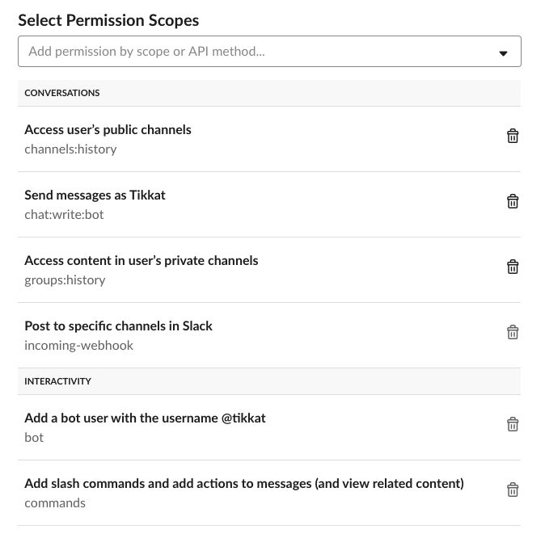

# Tikkat - Experimental PWS Platform Slack Bot


# Development notes

You can only run it locally if you have .envrc set up, see below for instructions. 

Tikkat requires Python3.6 or higher.  We use a virtual environment to fix the Python version and the 
packages we use (similar to package.json).  

For a new installation:
```
# create a virtual python environment in the .venv/
  python3 -m venv .venv  
# use the new python (you will have to repeat this every time you create a new shell )
  source .venv/bin/activate
# double check
  type pip # should return something ending in .venv/bin/pip
# install the packages we need
  pip install -r src/requirements.txt  
  
# test it
  cd src
  python tikkat.py

# when you are moving on to other work, close the shell or
# switch back to normal python
  deactivate
```


## Auth

- Get Airbase API key from cloudopstracker@gmail.com  page  
- Get base id from airtable.com/api (must be logged in), right click to get the url which
has the base id (starts with APP).
- All this stored in .envrc (in .gitignore)
- and backed up to lastpass as '/tikkat-envrc' (secure note)


## Slack App setup

- Visit https://api.slack.com/apps  to start the process
- Docs and step by step: https://api.slack.com/slack-apps
- Added a 'Tikkat' app
- Add slash command functionality to it, which requires an outgoing webhook.  Set this to tikkat.cfapps.io (where we )
  push this code), path `/rj75ud/slash`.  I obfuscated the URL just to be sure
- Set the permissions of the app, see screenshots below
- Retrieve the API token / OAUTH token, which is very long and starts with `xoxb-`. It can be found under the Permissions section of the app admin page.
  
- Store this in `.envrc`, lastpass and in the 
  Cloud Foundry environment:
  ```
  cf set-env tikkat SLACK_API_TOKEN $SLACK_API_TOKEN
  ```
- the app also requires a `SLACK_SIGNING_SECRET` which can be found on the main admin page under App Credentials there is a Signing Secret
  
  
- **TIP** Sync your `.envrc` with the CF environment by running:
   `awk '/^export/{split($2,kv,"="); print "cf set-env tikkat "kv[1]" "kv[2]}' .envrc | bash`
- Push this app so the endpoint is live


### Slack app admin page
https://api.slack.com/apps/AKELREXRS?created=1


### Slack app functionality

- enable incoming web hooks.  We don't need the Webhook URL, the python slack API finds it by itself. 
- 

### Slack enable events


### Slack app permissions



### Slack app setup for slash commands

Note that this setup is currently not used:  Slack allows its own slash commands (like `/star`) in threads, but user-defined slash commands (like `/tikkat`) 
cannot be used in threads.  We abandoned the slash command in favor of at-mentioning (like `@tikkat new ticket`). 


## The Slack APIs

There are too many, and they keep changing:
- The RTM (real time messaging) API is the old one, harder to use
- The Events API is what we use, easier, but only for listening.  In this API, listening to channels, direct messages and private groups is done with different calls.  Use this via a `slack_events_adapter`
- The Conversations API wraps the difference between the three types of messages.  But it is not accessible to Bots right now
- The Web API is for posting to Slack, ie creating messages.  Basically it is rest-like.  The SlackClient library has `api_call` to wrap this.  https://github.com/slackapi/python-slackclient/blob/master/docs-src/basic_usage.rst


## Airtable API 
is super simple, and very limited.  basically just crud
https://airtable.com/appG79slE6qPaJ3eV/api/docs#javascript/table:tickets


Notable
- cannot introduce Airtable-level @mention, only remove existing ones.
- cannot listen for changes in Airtable, only query current state
- links to 'action' table must be updated by reading, adding one and
  writing back, otherwise you'll replace all old ones with your one
  new one.
- cannot change the options of the dropdown
- 5 request per second cap per Base


## Airtable does not do change notifications yet.  
You can either query the table periodically, sort by time mod, and then take a few
latest and run this on a poll loop.
OR you can use the slack integration and poll the slack channel
(darkbots in our case).  This has the advantage that we have to poll
slack anyway, and we avoid eating into the 5rps rate limit that
Airtable imposes.

This guy's got it figured out, listening to slack to get Airtable change notifications:
https://medium.com/@yoad/retrieve-latest-changes-from-airtable-api-b473f5d4cdf9


Alternatives (not taken):
- https://community.airtable.com/t/knowing-when-there-is-a-change-to-the-record/1518/8
- https://community.airtable.com/t/notification-when-field-value-changes/15944/3


## Parsing the updates in darkbots

each message has attachments, the updates are part of the attachments.
https://api.slack.com/docs/message-attachments

The attachments have fields that reflect the airtable fields (columns) that were updated.  We can
simply check for changing of the State field

Code in `src/airtable_dates.py`.


## Using it on Cloud Foundry

in `src.envrc` are the variable setttings that cf needs.  This file is generated from a lastpass entry and it can be used
to set the CF env variables:
```
lpass show  'Shared-Cloud Ops/tikkat-envrc' --notes > src/.envrc
awk '/^export/{split($2,kv,"="); print "cf set-env tikkat "kv[1]" "kv[2]}' src/.envrc | bash
```


Then bring up tikkat on CF:
```
cd src 
cf push -f manifest.yml 
cf logs tikkat
```


